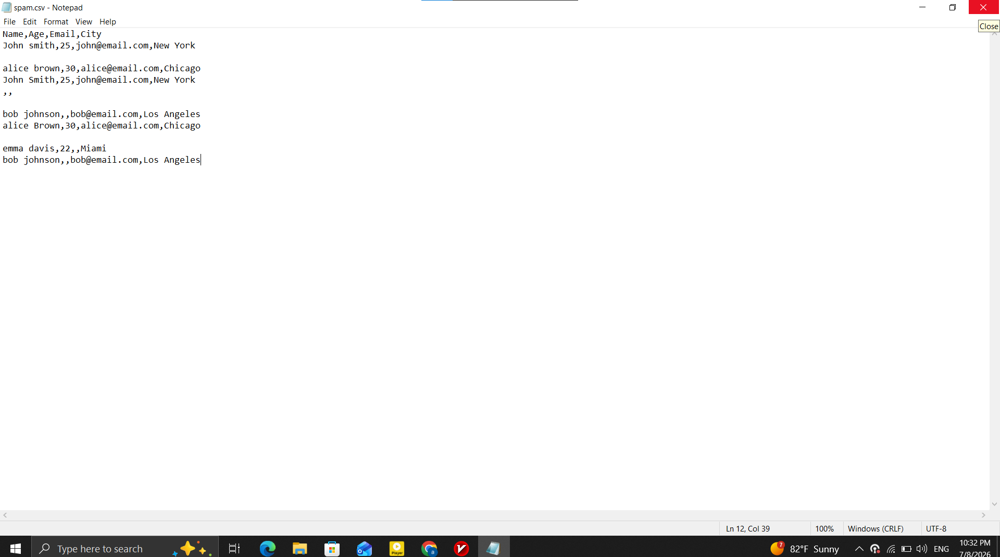
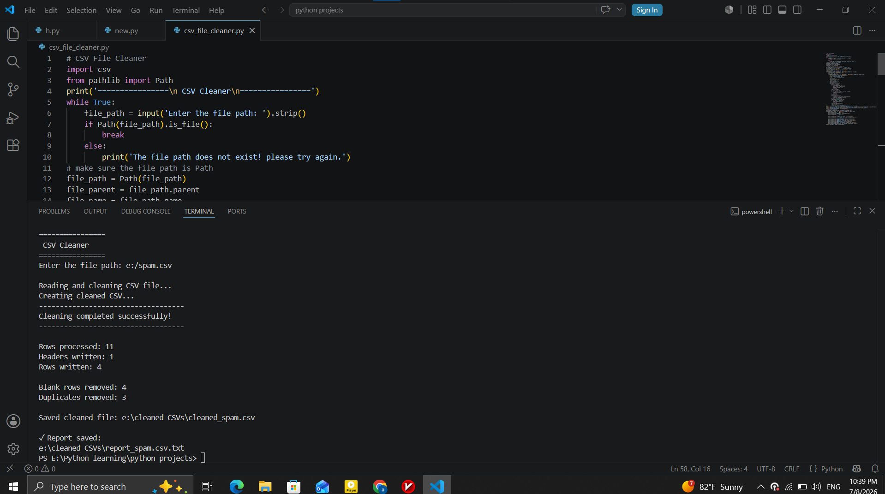
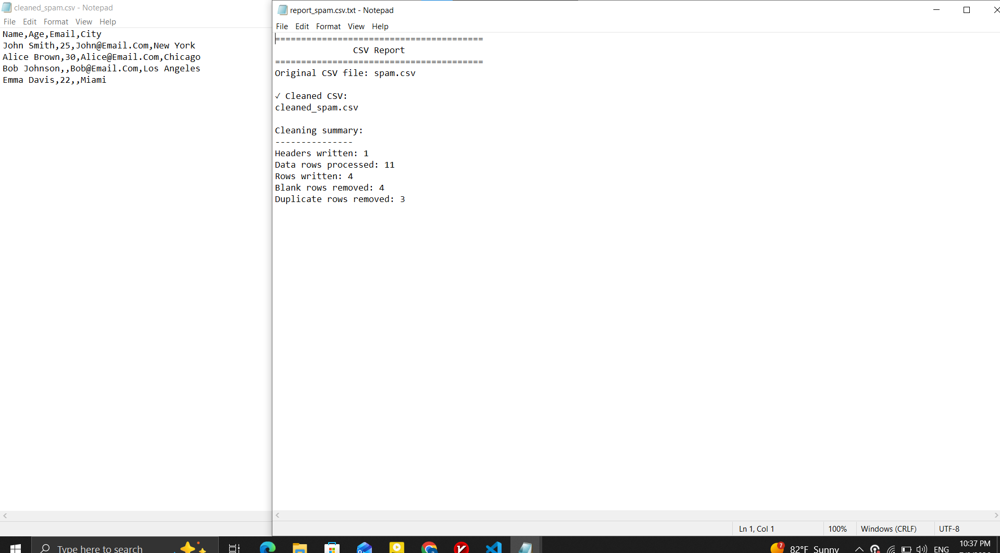

# 🧹 CSV File Cleaner

A Python CLI automation tool that cleans and standardizes CSV datasets by removing inconsistencies, eliminating duplicate records, and generating a cleaned output file.

The program processes CSV files non-destructively by preserving the original dataset, creating a cleaned copy, and generating a summary report of all modifications performed during execution.

---

## 🖥️ Pipeline Lifecycle & Live Demo

### Ingestion ➔ Processing ➔ Output

  
  

  

---

## 🧠 Core Features & Architecture

* 🧹 **Automated Data Cleaning:** Removes blank rows and trims unnecessary whitespace from CSV records.
* 🔤 **Text Normalization:** Standardizes text formatting using Title Case for improved consistency.
* 🚫 **Duplicate Detection:** Identifies and removes duplicate records while preserving unique data.
* 💾 **Safe File Processing:** Preserves the original CSV file and saves a cleaned copy in a separate output directory.
* 📊 **Cleaning Report:** Generates a detailed report summarizing processed rows, removed duplicates, blank rows, and output statistics.
* 📁 **Automatic Output Management:** Creates the required output folder automatically when it does not exist.

---

## 🛠️ Tech Stack & Requirements

* **Core Language:** Python 3.x
* **CSV Processing:** `csv`
* **File Handling:** `pathlib`

---
