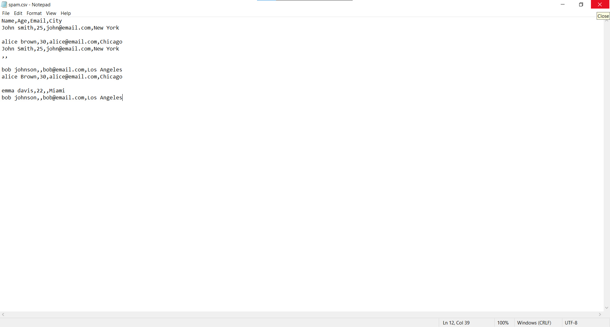
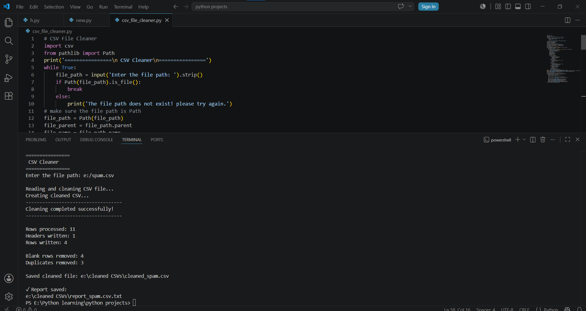
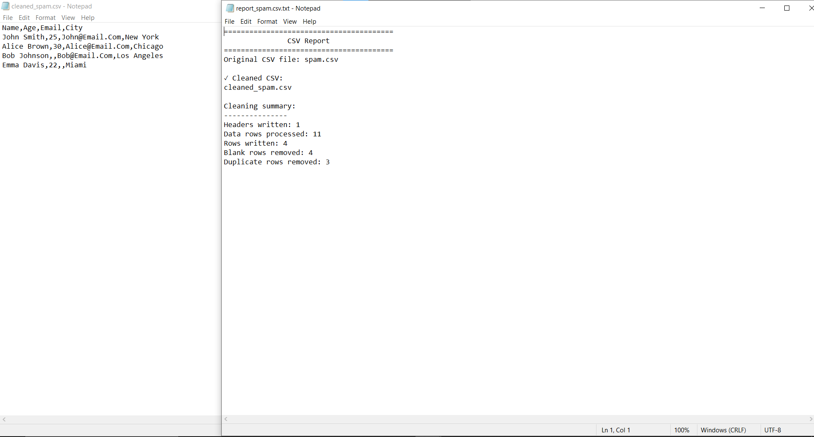

# 🧹 CSV File Cleaner


A Python automation tool that cleans CSV datasets by removing blank rows, standardizing values, eliminating duplicate records, and generating a cleaning summary report.

---

# 🖥️ Demo

### CSV Input ➜ Automated Cleaning ➜ Cleaned CSV Output

<p align="center">
  
  
</p>

<p align="center">
  
</p>

---

# 🎯 Problem

CSV datasets collected from different sources often contain blank rows, inconsistent spacing, duplicated records, and inconsistent text formatting.

Cleaning this data manually before analysis or importing it into another system is repetitive and time-consuming.

---

# ✅ Solution

This tool automates the cleaning process by:

- Removing blank rows
- Trimming unnecessary whitespace
- Standardizing text formatting
- Removing duplicate records
- Creating a cleaned CSV copy
- Generating a summary report of the cleaning process

The original CSV file is never modified.

---

# ⚡ Core Features

- 🧹 **Automated CSV Cleaning**  
  Removes blank rows and trims unnecessary whitespace from every record.

- ✨ **Data Standardization**  
  Standardizes text using Title Case to improve consistency across the dataset.

- 🚫 **Duplicate Removal**  
  Detects duplicate rows and keeps only unique records.

- 📊 **Cleaning Report Generation**  
  Creates a detailed text report summarizing processed rows, removed duplicates, blank rows, and output statistics.

- 📂 **Safe File Processing**  
  Preserves the original CSV file and saves cleaned data separately.

- 📁 **Automatic Output Management**  
  Creates the required output folder automatically when it does not already exist.

---

# 🛠️ Tech Stack

- **Language:** Python 3.x
- **CSV Processing:** Built-in `csv` module
- **File Handling:** `pathlib`

**External Dependencies:** None

---

# 🚀 Quick Start

## 1. Clone the repository

```bash
git clone https://github.com/DevBlueprintLab/python-csv-file-cleaner.git

cd python-csv-file-cleaner
```

## 2. Run the cleaner

```bash
python csv_file_cleaner.py
```

## 3. Provide your CSV file path

Example:

```text
================
 CSV Cleaner
================

Enter the file path:
sample_data/customer_data.csv

Reading and cleaning CSV file...
Creating cleaned CSV...

-----------------------------------
Cleaning completed successfully!
-----------------------------------

Rows processed: 120
Headers written: 1
Rows written: 113

Blank rows removed: 4
Duplicates removed: 3

Saved cleaned file:
cleaned_customer_data.csv

Report saved:
report_customer_data.txt
```

---

# 📁 Project Structure

```text
python-csv-file-cleaner/

├── csv_file_cleaner.py          # Main automation script
├── README.md                    # Project documentation
├── LICENSE                      # MIT License
├── sample_data/
│   └── customer_data.csv        # Example CSV dataset
└── images/
    ├── csv-input.png            # Original dataset
    ├── cleaning-process.png     # CLI cleaning process
    └── cleaned-csv-output.png   # Cleaned CSV output
```

---

# 💼 Practical Use Cases

This automation tool can help with:

- Cleaning exported business datasets
- Preparing CSV files before analysis
- Removing duplicate customer records
- Standardizing imported spreadsheet data
- Automating repetitive data-cleaning workflows

---

# 🔮 Future Improvements

- Automatically detect different CSV delimiters
- Add column-specific cleaning rules
- Preserve capitalization for email addresses and identifiers
- Export cleaned data directly to Excel

---

# 📜 License

This project is licensed under the MIT License.

---

Developed by **DevBlueprintLab**
